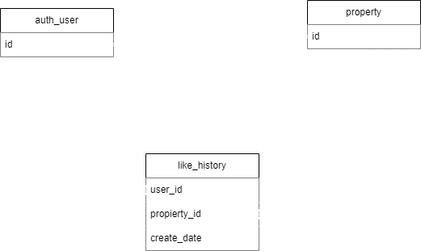

## Prueba Tecnica
Descripción
Este proyecto utiliza Flask para manejar una aplicación web con conexión a base de datos nativa y sin el uso de algun ORM. Flask se ha elegido debido a su flexibilidad y simplicidad para desarrollar aplicaciones web y manejar rutas de manera eficiente.

## Estructura del Proyecto
El proyecto está organizado de la siguiente manera:

project/
│
├── src/
│   ├── core/
│   │   ├── __init__.py
│   │   └── exceptions.py  # Contiene las excepciones personalizadas
│   │
│   └── controllers/
│       ├── __init__.py
│       └── immovables.py  # Controlador para manejar la lógica de inmuebles
│      
├── test_app_flask.py      # Pruebas para la aplicación Flask
├── app.py                 # Archivo principal que inicializa la aplicación Flask
└── requirements.txt       # Dependencias del proyecto

src/core/
Esta carpeta contiene el núcleo de la aplicación, incluyendo:

exceptions.py: Define las excepciones personalizadas utilizadas en la aplicación para manejar errores específicos.
src/controllers/
Esta carpeta contiene los controladores que manejan la lógica de negocios:

immovables.py: Controlador para la gestión de inmuebles, incluyendo la recuperación de datos desde la base de datos.
Configuración del Entorno
Instalación de Dependencias

### Instalacion de las dependencias necesarias:

pip install -r requirements.txt

### Ejecución de la Aplicación
python app.py -> Esto iniciará el servidor

### Ejecutar Pruebas

Para ejecutar las pruebas, en la raíz del proyecto:

pytest

Uso
La aplicación proporciona una ruta raíz (/) que permite recuperar todos los inmuebles basados en parámetros de consulta.

# Segundo requerimiento 
Para el segundo punto se puede crear una tabla de rompimiento que relaciona la propiedad y el usuario junto con una fecha de creaciòn para saber cuando fue el like

### sql 
CREATE TABLE user_property_association (
    id SERIAL PRIMARY KEY,       
    user_id INT NOT NULL,        
    property_id INT NOT NULL,    
    create_date TIMESTAMP DEFAULT CURRENT_TIMESTAMP, 
    FOREIGN KEY (user_id) REFERENCES users(id) ON DELETE CASCADE, 
    FOREIGN KEY (property_id) REFERENCES properties(id) ON DELETE DO_NOTHING  
);